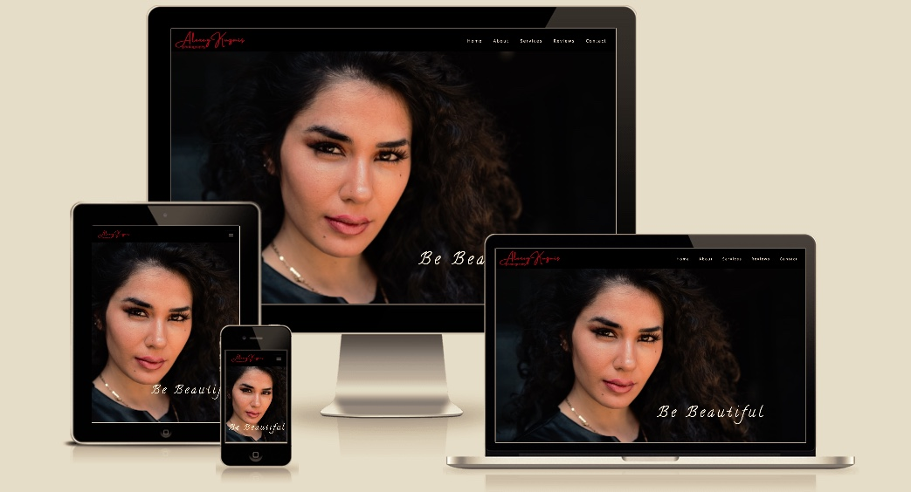
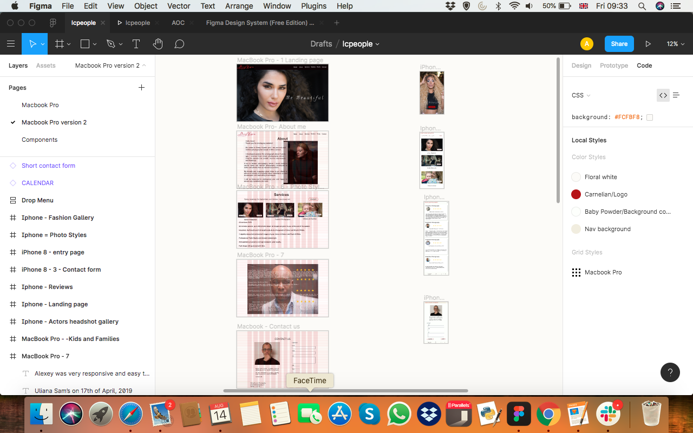

**README.md**

**Alexey Kuzmis Photography**

   

**Contents**

UX Development
	1. Project Goals
	2. UX Requirements
		2.1. Users
		2.2 User Goals
		2.3. Photographer Goals
		2.4. User Stories
			2.4.1 First time Visitors
			2.4.2 Returning Visitors
		2.5. Design Choices
			2.5.1 Fonts
			2.5.2. Icons
			2.5.3. Colours
	3. Features & Future Releases
		+ Technology used
	4. Technology used
	5. Testing
	6. Project Deployment
	7.  Credits
	8.  Acknowledgements

## UX Development

### 1. Project Goals

  [Alexey Kuzmis Photography](https://alexeykuz-sys.github.io/MS1-AKPhotography/)
		
The website is built for the inspiring photographer. The website will help photographer to reach potential clients, interested in fashion or model/actors headshots photoshoot and to exhibit photographer’s work.

Website features a gallery, testimonials, about page, prices, a clear step-by-step booking process and a contact page. 
The primary goal of the website is to show photographer's work in order to help potential customers to associate their needs with photographer's style, to see the history of previous assignments, customer's satisfaction level and to make the first contact with the photographer and promote photographer’s work.

As most of the photographer’s clients are consumers, the site is build to create easy and effortless process of finding, associating with client’s needs and booking. It’s mainly B2C orientation, which focuses on impulse booking rather than long tedious process of discussions and enquiries.

The website has to provide attractive, clear and safe framework for clients that will translate to safe and enjoyable experience during the photoshoot.

  
### 2. UX requirements

The website targets the individuals who would need their photo taken for personal or business purposes. The clients will want to record the certain moments of their lives or achievements or to update and advance their personal brand on social media websites.

### 2.1. Users:

1.  Private people interested to update their social network photos,
2.  Models,
3.  Actors,
4.  Corporate clients,
5.  Families.

### 2.2. User goals:

1.  To identify user needs with services offered;
2.  Find information about the photographer;
3.  Find information about the photographer’s services and prices;
4.  To be able to scroll through images to reconfirm they correspond to user’s requirements;
5.  Contact photographer with enquiries;
6.  Book the photoshoot with 2-3 easy steps.

### 2.3. Photographer Goals

The site owner has the following goals:

1. Show what his business is about.
2. Highlight the photographer’s style.
3.  Show customers photographers work as a gallery or images and as illustration embedded in the site information.
4. Show customers other customers experience.
5. Allow customers to make contact with photographer for general enquiries.
6. Allow customers to make bookings.
7. Be mobile friendly with a responsive layout design for a smooth desktop experience.
8. To have a clean and simple in design and not be perceived as overloaded and cluttered with excessive content.
9. Allow customers to make payments and track this for easy management of bookings and payments

### 2.4. User Stories

**2.4.1 First time Visitors**

1.  Visitor to the website, I want to easily navigate the site and find what visitor needs within short attraction span
2.  Visitor will want to view a gallery to identify with visitor’s taste and needs.
3.  Visitor want to learn more about the artist, to connect and to feel safe.
4.  Visitor wants to know what past clients thoughts of  artwork and the service they received.
5.  As a potential client, I want to see clear, fixed prices and what services they cover to have a clear budget.
6.  Visitor wants an easy way to contact photographer.
7.  As a client, I want to follow the artist on social media, so I can keep up with her latest works.

**2.4.2 Returning Visitors**

1.  As a returning visitor to see the latest photographers photos;
2. To see photographer's availability;
3. To be able to book quickly and easy. 

### 2.5. Design Choices

When designing this website, I looked for the design inspiration from various photographers websites and UX reviews on youtube.

I have noticed that some photographers have accent on the photo galleries rather easy way to navigate and to reach information or booking pages. It can cause frustration and stop potential customer from contacting photographer and booking the photography session. I tried to achieve the balance satisfying artistic and B2C requirements.

**2.5.1 Fonts**

I have used Google Fonts to determine the best fonts suitable for each part of the website, I.e. Logo, Menu and Body information.

I opted to use Open Sans font for my website, which is one of the most popular fonts used by major internet companies.

[Best Google Fonts](https://nestify.io/blog/top-10-best-google-fonts/)

**2.5.2. Icons**

Icons used where provided by [Font Awesome](https://fontawesome.com/), used in moderation and are self explanatory.

**2.5.3. Colours**

The colours were determined by the palette of [Cooler](https://coolors.co/) website:

-   For body text and some titles: #22181C;
-   For Logo and and navbar menu and prices: #B71419;
-   For body background: #FAF9F9.

**2.5.4. Wireframe**

I used Figma to build Mobile and Desktop design of the website.
View my wireframes here:

   

### 3. Features

The website is built of 5 scroll down pages. It makes website easier to load and navigate. Users can easily navigate website by either scrolling down or going through Navigation Bar.

**Navigation bar**

Navigation bar structures of the photographer's Logo(i.e. his name) and menu. The Menu includes links to Home, About, Services, Reviews and Contact pages. Users can easily return to the top of the website either pressing Logo or Home tab.

**About**

About page is built of two collumns. The left column is the text, introucing photographer to the users, and the right page show one of the client's portraits.

**Services**

The service page consist of three parts. The top part is the Announcement line, showing photographer's availibility and prompting users to book the photoshoot at the specific months without delays. 
Middle part consist of three card, showing sevices provided by the photographer. Each card has a photo corresponding the service and two action button, prompting users either to check out the galleries or to book the photoshoot.It should be noted that galleries are stored in the cloud and are open in the separate window to enable fast loading of the webiste.
Underneath the cards there is a price section, clearly spelling the price and what this price includes. The user will have aclear pictures from this page of the services and prices offered by the photographer.

**Reviews**

The review page has four reviews with pictures of the clients.

**Contact**

The contact page has two columns. The left column is the self portrait of the photographer with few words specifing services and studio location. It will help to improve webiste SEO rating. 
The right side is the contact form where clients have to include their dirst name and surname, email, choose kind of photoshoot they need and space for additional text. All fields are marked with Required attribute.

**Footer**

The bottom of the page is the footer with the name and direct contacts of the photographer and socila media links.

Features that have been implemented:

-   Responsive on all device sizes;
-   Interactive elements;
-   Easy to use navigation on all screen;
-   Scrolling navigation;
-   Contact form;
-   Attractive design;
-   Social media links.

Features that will be implemented in the future:

-   Calendar
-   Booking form
-   Workshops
-   Blog

### 4. Technologies Used

**UX/UI design**
-   [Figma](https://figma.com/)

**Languages**

-   [HTML](https://developer.mozilla.org/en-US/docs/Web/HTML)
-   [CSS](https://developer.mozilla.org/en-US/docs/Web/CSS)

**Tools & Libraries**

1.  [Bootstrap 4.4.1:](https://getbootstrap.com/docs/4.4/getting-started/introduction/)
    -   Bootstrap was used to assist with the responsiveness and styling of the website.

2.  [Google Fonts:](https://fonts.google.com/)
    -   Google fonts were used to import the 'Titillium Web' font into the style.css file which is used on all pages throughout the project.
  
3.  [Font Awesome:](https://fontawesome.com/)
    -   Font Awesome was used on all pages throughout the website to add icons for aesthetic and UX purposes.
 
4.  [Git](https://git-scm.com/)
    -   Git was used for version control by utilizing the Gitpod terminal to commit to Git and Push to GitHub.
    
5.  [GitHub:](https://github.com/)
    -   GitHub is used to store the projects code after being pushed from Git.

6.  [Figma:](https://figma.com/)
    -   Figma was used to create the  wireframes during the design process.
 
### 5. Testing

The W3C Markup Validator and W3C CSS Validator Services were used to validate every page of the project to ensure there were no syntax errors in the project.

-   [W3C Markup Validator](https://jigsaw.w3.org/css-validator/#validate_by_input)  -  No Warnings

-   [W3C CSS Validator](https://jigsaw.w3.org/css-validator/#validate_by_input)  -  No Warnings 
- 
- [Website responsiveness]([http://ami.responsivedesign.is/](http://ami.responsivedesign.is/)

- [Google Mobile-Friendly Test](https://search.google.com/test/mobile-friendly) - Page is mobile friendly.

**Responsiveness** 

I've used **Bootstrap** and Flexbox throughout the project to ensure **maximum** responsibility, which is tested with the above tools.

**First Time Visitor Goals Test**
    
- As a First Time Visitor, I want to easily understand the main purpose of the site and learn more about the photographer.
- Upon entering the site, users are automatically greeted with a clean and intuitive navigation bar to go to the page of their choice. Underneath there is a Hero Image to give users the first impression of photographer work.
- The user has two options, click the menu or scroll down, both of which will lead to the same place, to learn more about the photographer.
- As a First Time Visitor, I want to be able to navigate easy and logically throughout the site to find content.
- The site has been designed to be fluid and never to entrap the user by excessive amount of photos or text. At the top of each page there is a clean navigation bar, each link describes what the page they will end up at clearly.
- Fixed to the top navigation bar ensures that user can easily navigate to the required page at any moment.
- As a First Time Visitor, I want to look for testimonials to understand what previous clients think of photographer's work and see if he can be trusted. There are also links to the social media to see how active, serious and trustful is a photographer.
- Once the new visitor has read the About they will reach Services page, where they can choose the kind of photography services they need and either look through the images stored in cloud to ensure fast website performance or to book services.
- The user can also scroll to the bottom of the Contact Page where there are alternatively way to contact photographer either directly or via social media links.

**Returning Visitor Goals Test**
    
- As a Returning Client, I want to find the photographer's latest works, availability calendar and booking form.
- These are clearly shown in the service page with call for action button and announcement line.
- The navigation bar clearly highlights the "Contact Us" Page.
- Here they can fill out the form on the page or are told that you can contact photographer directly or via social media.
- The footer contains links to the organisations Facebook, Twitter and Instagram page as well as the photographer's mobile and email.
- Whichever link they click, it will be open up in a new tab to ensure the user can easily get back to the website.
    
**Further Testing**

-   The Website was tested on Google Chrome and Safari browsers.
-   The website was viewed on a variety of devices such as Desktop, Laptop, iPhone 6, iPhone 7 & iPhoneX.
-   A large amount of testing was done to ensure that all pages were linking correctly.
-   Friends and family members were asked to review the site and documentation to point out any bugs and/or user experience issues.

**Manual testing of all elements of each page.**

- Home Page

* Made sure that navigation bar and hero image are covering the full page.
* Checked that all navigation menu links work and lead to the correct page
* Checked that logo brings users back to Home page.
* Checked responsiveness of the page

- About page

* Checked that image and text are evenly spread and covered.
* Checked responsiveness of the page

- Service page

* Checked that all items are evenly spread and cover the full page
* Checked that all action buttons work and lead users to the correct gallery or Contact page.
* Checked responsiveness of the page

- Review Page

* Checked if cards are evenly spread
* Checked responsiveness of the page

- Contact Page

* Checked that form works and user has to fill out all parts of the form to be able to send  message.
* Checked responsiveness of the page

### 6. Project Deployment

**GitHub Pages**

The project was deployed to GitHub Pages using the following steps...

1.  Log in to GitHub and locate the  [GitHub Repository](https://github.com/)
2.  At the top of the Repository (not top of page), locate the "Settings" Button on the menu.
3.  Scroll down the Settings page until you locate the "GitHub Pages" Section.
4.  Under "Source", click the dropdown called "None" and select "Master Branch".
5.  The page will automatically refresh.
6.  Scroll back down through the page to locate the link to now published site  
  [Alexey Kuzmis Photography](https://alexeykuz-sys.github.io/MS1-AKPhotography/)  in the "GitHub Pages" section.

**Forking the GitHub Repository**

By forking the GitHub Repository we make a copy of the original repository on our GitHub account to view and/or make changes without affecting the original repository by using the following steps...

1.  Log in to GitHub and locate the MS1-AKPhotography repository.
2.  At the top of the Repository (not top of page) just above the "Settings" Button on the menu, locate the "Fork" Button.
3.  You should now have a copy of the original repository in your GitHub account.

**Making a Local Clone**

1.  Log in to GitHub and locate the MS1-AKPhotography repository.
2.  Click the green  **Clone or Download**  button.
3.  Copy  the url in the  dropdown box.
4. Using your IDE open up your  terminal.
5. Navigate  to your desired file  location.

Copy the following code and input it into your terminal to clone.
$ git clone https://github.com/alexeykuz-sys/MS1-AKPhotography.git

6. Press Enter. Your local clone will be created.

### 7. Credits

 **Media**

-   The images used in this project belongs to photographer.

**Code**

-   The HTML/CSS used for the Navigation Bar was inspired by Drew Ryan video on Youtube.
-   [Bootstrap4](https://getbootstrap.com/docs/4.4/getting-started/introduction/): Bootstrap Library used throughout the project mainly to make site responsive using the Bootstrap Grid System.
    
-   Flexbox was used to make site responsive and position elements on the page

    **Content**
-   All content was written by the developer.
    
    **Media**

-   All Images were created by the developer.

### 8. Acknowledgements

-  My Mentor Oluwafemi Medale for continuous helpful feedback.
-  Tutor support at Code Institute for their support.
-  Slack community for support and inspiration.
- Various youtube channels.

**Disclaimer**

The content on this website is for the purpose of this project only.
